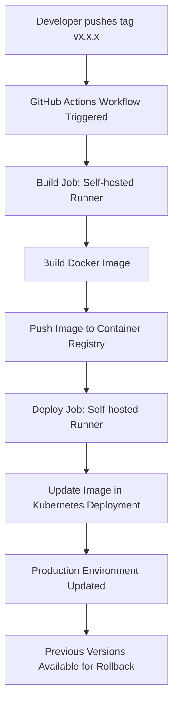

# ⚙️ CI/CD Pipeline

This document describes the CI/CD pipeline configuration for **VOICO GmbH**, defined in  
`.github/workflows/main.yml` for each repository.

---

## 🚀 Overview

The pipeline is powered by **GitHub Actions** and runs entirely on a **self-hosted GitHub Runner**.  
It automates the **build**, **push**, and **deployment** of Docker images across different environments — ensuring consistent, versioned, and reversible releases.

---

## 🏷️ Versioning Strategy

The system is triggered **only by Git tags** that follow the semantic versioning pattern:

```

vX.X.X

```

For example:

```

v1.0.0
v2.3.1

```

This approach ensures that:

- Deployments only occur for explicit version tags (not random commits).
- Each deployment corresponds to a fixed version.
- Rollbacks are easy: you can re-run a previous workflow tied to an older tag.

---

## 🧩 Environments

| Environment     | Platform   | Purpose                                      |
| --------------- | ---------- | -------------------------------------------- |
| **Development** | Railway    | For initial feature testing and integration. |
| **Stage**       | Railway    | For pre-production validation and QA.        |
| **Production**  | Kubernetes | For live, stable releases.                   |

Each environment uses the same image base, making transitions between them seamless.

---

## 🐳 Container Images

All images are built and pushed to a **private container registry**:

```

swr.eu-de.otc.t-systems.com/voico

```

- Each image is tagged with its version (`vx.x.x`).
- The containers are built **without embedded environment variables**, making them fully configurable at deployment time.
- This allows flexible use of the same image in different environments by injecting configuration externally.

---

## 🔄 Workflow Steps

### 1. **Trigger**

The pipeline runs when a tag matching the pattern `v*.*.*` is pushed to the repository.

```yaml
on:
  push:
    tags:
      - "v*.*.*"
```

### 2. **Build Job**

- Runs on a **self-hosted runner**.
- Extracts the version from the tag (`vX.X.X` → `X.X.X`).
- Executes the build script:

  ```bash
  bash ./build_and_push.sh $VERSION
  ```

- Cleans up the Docker environment afterward to free space.

### 3. **Deploy Job**

- Depends on the successful completion of the **build** job.
- Updates the image of the corresponding Kubernetes deployment using:

  ```bash
  kubectl set image deployment/<deployment-name> \
    <container-name>=<registry>/<image>:<version> \
    -n production
  ```

---

## 🧰 File Structure

The CI/CD workflow file is stored in:

```
.github/workflows/main.yml
```

The related scripts (such as `build_and_push.sh`) are kept at the root of each repository or in a shared internal repository.

---

## 🔁 Rollbacks and Traceability

Since every deployment corresponds to a version tag:

- You can view all past deployments in the **GitHub Actions → Workflows** tab.
- Re-running a previous workflow instantly redeploys that version.
- This makes rollbacks reliable, transparent, and easy to track.

---

## 🧭 CI/CD Flow Diagram



---

## ✅ Summary

**Key Benefits:**

- Clear version control via tags (`vx.x.x`).
- Automated build and deployment from GitHub Actions.
- Full configurability of containers (no baked-in env vars).
- Consistent environments: Railway for testing, Kubernetes for production.
- Self-hosted runner for better control and performance.
